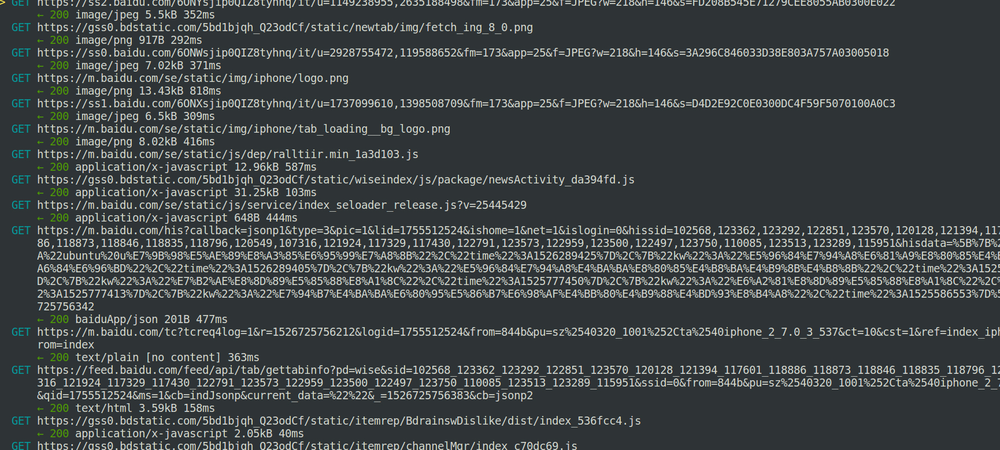

## mitmproxy

中间人攻击神器，具体用处与简介请自行百度或脑补

* 安装

```
sudo apt-get install mitmproxy

```

> 安装成功后会在生成两个工具mitmproxy与mitmdump

* 代理

https 请求需要将 `~/mitmproxy/mitmproxy-ca-cert.cer` 复制到手机上，并安装

```
mitmproxy -p 8080

```

> 在手机设置中设置代理，PS:请保证电脑与手机在同一网段。



* 快捷键

enter 查看请求  tab 切换   q 退出请求  ? 信息帮助界面   C 清除所有请求


## ettercap

* 安装

```
sudo apt-get install ettercap-common

```

> 使用参考[网上](https://blog.csdn.net/farsight2009/article/details/52459273)

